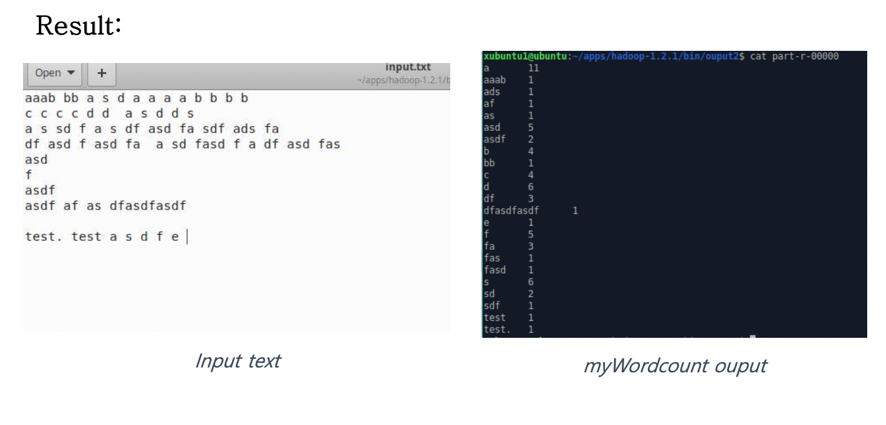

# KAU_Bigdata_hadoop
KAU Hadoop term-project.

하둡에서 동작하는 string 처리 MapReduce 프로그램입니다.

### test
```
  hadoop jar ./myWordcount.jar myWordcount /test/input.txt /test/output
```


## WordCount
input 스트링의 단어 갯수 계산.



## Pair
input 스트링에서 한 줄에 함께 등장한 단어 쌍의 수 계산.


## Stripes
input 스트링에서 각 단어 별 함께 등장한 단어와 횟수 계산.


## Frequency
P(A|B) B단어가 등장하였을 때, A 단어가 함께 등장할 조건부확률을 계산.


